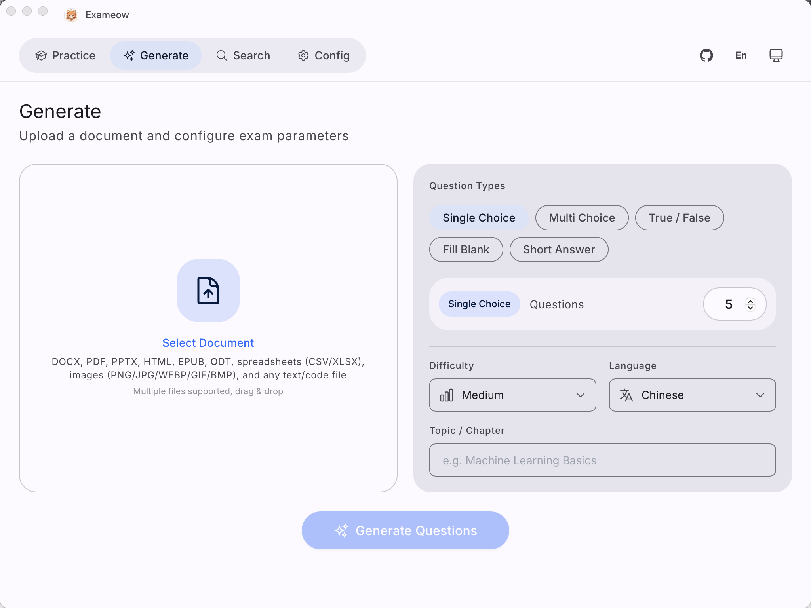
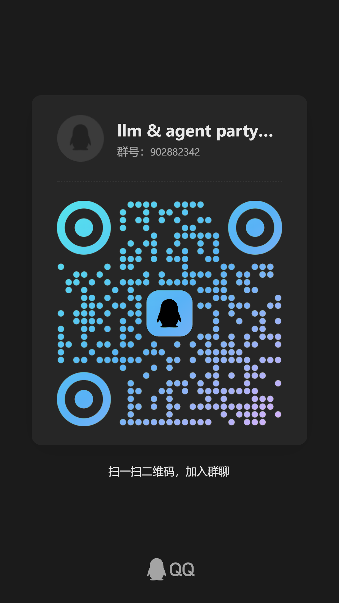

# Exameow

AI-powered exam question generator. Upload study materials, generate professional exam questions in seconds.

<div align="center">

[](README.md)
[](README_zh.md)

</div>



## Live Demo

Try it online: **[exam.superagentparty.com](https://exam.superagentparty.com/)**

The demo runs on Cloudflare Workers with the free Workers AI tier:

- ⏳ **Daily quota is limited** — Cloudflare's free AI allocation resets daily
- 📄 **Context window limit** — large documents will be truncated to fit the model's context window

For unlimited usage, self-host with Docker or use the desktop/mobile apps with your own API key.

## Features

- **Document Parsing** — Supports PDF, DOCX, XLSX, PPTX, EPUB, ODT, TXT, CSV, HTML
- **AI Question Generation** — Compatible with any OpenAI-format API (OpenAI, DeepSeek, Qwen, GLM, etc.)
- **Multiple Question Types** — Single choice, multiple choice, true/false, fill-in-the-blank, short answer
- **Export** — Download results as XLSX or CSV
- **Practice Mode** — Built-in quiz system with wrong-question tracking
- **Multi-Platform** — Desktop (macOS/Windows/Linux), Mobile (iOS/Android), Web, Docker, Cloudflare

## Installation

Pre-built binaries for all platforms are available on the [GitHub Releases](https://github.com/heshengtao/exameow/releases) page.

### Platform Support

| Platform | Status | Download |
|----------|--------|----------|
| Windows | ✅ Supported | `.msi` installer / portable `.zip` |
| macOS (Apple Silicon) | ✅ Supported | `.dmg` (see release notes to remove quarantine) |
| Linux (x86_64 / ARM64) | ✅ Supported | `.AppImage` / `.deb` |
| Android (ARM64) | ✅ Supported | `.apk` |
| iOS | ⚠️ Self-build required | See note below |
| Web / Docker (self-hosted) | ✅ Supported | Docker image |

> **About iOS:** An Apple Developer certificate costs $99/year, so no pre-built iOS package is provided for now — you'll need to build it yourself with Xcode (`pnpm tauri ios build`). If future donations cover the certificate fee, an officially signed iOS build will be published on GitHub Releases.

### Docker (Self-Hosted)

```bash
git clone https://github.com/heshengtao/exameow.git
cd exameow

# Build frontend
cd frontend && pnpm install && pnpm build && cd ..

# Configure AI provider
export AI_ENDPOINT=https://api.openai.com/v1
export AI_API_KEY=sk-your-key-here
export AI_MODEL=gpt-4o

# Build and run
docker compose up -d --build
```

Open `http://localhost:3000`.

### Docker (Pre-Built Image)

```bash
docker pull ailm32442/exameow:latest
docker run -d -p 3000:3000 \
  -e AI_ENDPOINT=https://api.openai.com/v1 \
  -e AI_API_KEY=sk-your-key-here \
  -e AI_MODEL=gpt-4o \
  ailm32442/exameow:latest
```

## Environment Variables

| Variable | Default | Description |
|----------|---------|-------------|
| `AI_ENDPOINT` | `https://api.openai.com/v1` | OpenAI-compatible API endpoint |
| `AI_API_KEY` | — | Your AI API key |
| `AI_MODEL` | `gpt-4o` | Default model to use |
| `PORT` | `3000` | Server listen port |
| `STATIC_DIR` | `/app/static` | Static files directory |
| `RUST_LOG` | `info` | Log level |

## API Endpoints

| Method | Path | Description |
|--------|------|-------------|
| `GET` | `/api/models` | List available AI models |
| `POST` | `/api/generate` | Upload file + generate exam questions |
| `GET` | `/api/export` | Export questions as CSV |
| `POST` | `/api/export/xlsx` | Export questions as XLSX |
| `POST` | `/api/config/save` | Save AI configuration |
| `GET` | `/api/config/load` | Load saved AI configuration |

### Generate Exam

```bash
curl -X POST http://localhost:3000/api/generate \
  -F "file=@study-material.pdf" \
  -F 'params={"question_types":["single_choice","multi_choice"],"count":10,"difficulty":"medium","language":"Chinese"}'
```

## Architecture

```
┌─────────────────────────────────────────────────────┐
│  Frontend (Vue 3 + Vite + Pinia)                    │
│  Served as static files from the Rust server        │
├─────────────────────────────────────────────────────┤
│  Server (Rust / Axum)                               │
│  ├── File Parser   (PDF, DOCX, XLSX, PPTX, EPUB…)  │
│  ├── AI Client     (OpenAI-compatible API)          │
│  ├── Exam Builder  (Prompt engineering + parsing)   │
│  └── Export        (XLSX, CSV)                     │
├─────────────────────────────────────────────────────┤
│  Deploy Targets                                     │
│  ├── Docker (self-hosted)                           │
│  ├── Tauri Desktop (macOS / Windows / Linux)        │
│  ├── Tauri Mobile (iOS / Android)                   │
│  └── Cloudflare Pages + Worker                      │
└─────────────────────────────────────────────────────┘
```

## Development

```bash
# Rust server
cargo run -p exameow-server

# Frontend dev server
cd frontend && pnpm dev

# Tauri desktop app
pnpm tauri dev
```

### Project Structure

```
exameow/
├── frontend/          # Vue 3 SPA
├── packages/
│   ├── core/          # Rust shared library (AI, parser, export, config)
│   ├── server/        # Axum HTTP server
│   └── shared/        # TypeScript shared types
├── src-tauri/         # Tauri desktop + mobile app
├── workers/           # Cloudflare Workers (Hono)
├── scripts/           # Build and deploy scripts
├── Dockerfile
└── docker-compose.yml
```

## Support

### Please star us!
⭐ Your support is the driving force for us to move forward!

### Tips Welcome!
<div align="center" style="display: flex; gap: 20px; justify-content: center; flex-wrap: wrap;">

[](https://ko-fi.com/agentparty)
[](https://afdian.com/a/agentparty)

</div>

### Follow us
<div align="center">
  <a href="https://space.bilibili.com/26978344">
    
  </a>
  <a href="https://www.youtube.com/@agentParty">
    
  </a>
</div>

### Join the Community
If you have any questions or issues with the project, you are welcome to join our community.

1. QQ Group: `931057213` (Full) / `902882342` (Group 2)

<div align="center">
    
</div>

2. Discord: [Discord link](https://discord.gg/f2dsAKKr2V)

## Contributors

<a href="https://github.com/heshengtao/exameow/graphs/contributors">
  
</a>

## License

Apache-2.0

## Third-Party Licenses

This project uses third-party open source software. A complete list of dependencies, their licenses, and license URLs can be found in [THIRD_PARTY_LICENSES.csv](THIRD_PARTY_LICENSES.csv).
