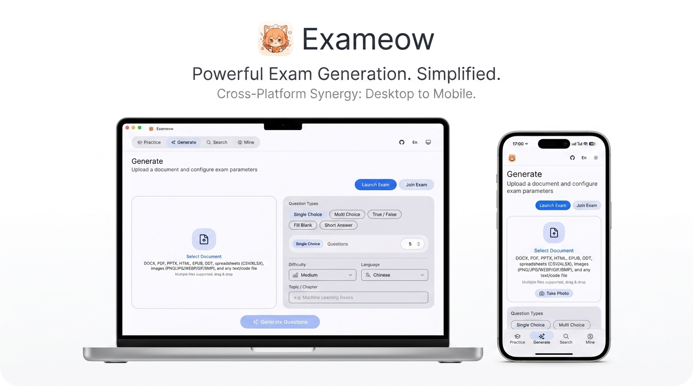

# Exameow

AI-powered exam question generator. Upload study materials, generate professional exam questions in seconds.

<div align="center">

[](README.md)
[](README_zh.md)

</div>



## Live Demo

Try it online: **[exam.superagentparty.com](https://exam.superagentparty.com/)**

The demo runs on Cloudflare Workers with the free Workers AI tier:

- ⏳ **Daily quota is limited** — Cloudflare's free AI allocation resets daily
- 📄 **Context window limit** — large documents will be truncated to fit the model's context window

For unlimited usage, self-host with Docker or use the desktop/mobile apps with your own API key.

## Features

### ✨ AI Question Generation
- **Rich Input Formats** — PDF, DOCX, XLSX, PPTX, EPUB, ODT, TXT, CSV, HTML, images (PNG/JPG/WEBP/GIF/BMP), and any text/code file; multi-file upload with drag & drop
- **5 Question Types** — Single choice, multiple choice, true/false, fill-in-the-blank, short answer, with per-type count control
- **Fine-Tuned Control** — Difficulty (easy/medium/hard), output language, and topic/chapter filtering
- **Smart Batching** — Large documents are automatically split and generated in batches with deduplication
- **Any OpenAI-Compatible API** — OpenAI, DeepSeek, Qwen, GLM, etc.; or use the built-in free Cloudflare AI on the demo site
- **Export** — Download results as XLSX or CSV

### 📚 Practice Modes
- **Sequential Practice** — Go through a question bank in order
- **Random Practice** — Questions and options shuffled for better retention
- **Mock Exam** — Auto-generate a randomized exam paper from any bank with configurable type counts
- **Wrong-Question Review** — Track mistakes, practice only what you got wrong, and watch them clear as you improve
- **Exam / Flashcard Modes** — Answer blind, or flip through questions with answers visible
- **AI Grading** — Short-answer questions graded by AI against reference answers, with feedback; manual regrading supported
- **Question Bank Management** — Import banks from XLSX/CSV with smart column mapping; export anytime

### 📝 Online Exams
- **Launch Exams from Banks** — Compose exams from multiple local banks with per-type question counts and point values; set title, start time, and duration
- **6-Digit Code + Exam Link** — Students join from any device browser, no app install required
- **Timed Sessions** — Local countdown with auto-submit; progress survives page refresh (resume where you left off)
- **Instant Scoring** — Objective questions graded server-side with answers and analysis on submission; results stored locally for anytime review
- **Teacher Dashboard** — Score-sorted results with per-question drill-down; locally cached so results are only fetched once after the exam ends; teachers can delete an exam anytime (instantly blocks students and purges results)
- **Privacy-First Relay** — Exam data lives on Cloudflare D1 for at most 7 days before automatic deletion; answers are never sent to students before submission
- **Anti-Abuse** — 20 publishes per IP per day; one-tap student reports auto-suspend an exam at 3 distinct-IP reports; admins review, restore, or delete from the `#/admin` page
- **Fully Self-Hosted** — The Docker image ships the same exam relay (SQLite), with zero dependency on the demo site; set `ADMIN_TOKEN` to secure the admin page (defaults to `pass`, must be changed on first visit to `#/admin`)

### 🔍 Search Modes
- **Text Search** — Type or paste a question to find matches in your local banks, with optional AI answering
- **Photo Search** — Snap or upload a photo of a question; on-device OCR (runs locally in your browser, no upload)
- **Camera Live Search** — Point your camera at the screen/paper; AI watches and matches questions in real time
- **Screen Record Search** — Draw a capture frame over any window; AI monitors it and matches questions live, with a floating answer overlay (Windows / macOS / Linux / Android; not available on iOS due to system restrictions)

### 🌐 Cross-Platform & Privacy
- **Desktop & Mobile** — Windows, macOS, Linux, Android (iOS self-build)
- **Self-Hosted Web** — One-command Docker deployment
- **Local-First** — Question banks, practice records, and wrong questions stay on your device; API keys encrypted with AES-256-GCM on desktop
- **Bilingual UI** — Auto-detects system language (Chinese / English), one-tap switch

## Installation

Pre-built binaries for all platforms are available on the [GitHub Releases](https://github.com/heshengtao/exameow/releases) page.

### Platform Support

| Platform | Status | Download |
|----------|--------|----------|
| Windows | ✅ Supported | `.msi` installer / portable `.zip` |
| macOS (Apple Silicon) | ✅ Supported | `.dmg` (see release notes to remove quarantine) |
| Linux (x86_64 / ARM64) | ✅ Supported | `.AppImage` / `.deb` |
| Android (ARM64) | ✅ Supported | `.apk` |
| iOS | ⚠️ Self-build required | See note below |
| Web / Docker (self-hosted) | ✅ Supported | Docker image |

> **About iOS:** An Apple Developer certificate costs $99/year, so no pre-built iOS package is provided for now — you'll need to build it yourself with Xcode (`pnpm tauri ios build`). If future donations cover the certificate fee, an officially signed iOS build will be published on GitHub Releases.

### Docker (Self-Hosted)

```bash
git clone https://github.com/heshengtao/exameow.git
cd exameow

# Build frontend
cd frontend && pnpm install && pnpm build && cd ..

# Configure AI provider
export AI_ENDPOINT=https://api.openai.com/v1
export AI_API_KEY=sk-your-key-here
export AI_MODEL=gpt-4o

# Build and run
docker compose up -d --build
```

Open `http://localhost:3000`.

> **🔐 Admin token (required for online-exam administration):** the admin page at `http://localhost:3000/#/admin` is protected by `ADMIN_TOKEN`. If you don't set it, it defaults to **`pass`** and you will be **forced to change it on first login** before you can do anything. To skip that, set it at startup:
>
> ```bash
> ADMIN_TOKEN=your-strong-token docker compose up -d --build
> ```
>
> The changed token persists in the `exameow-data` volume (`/app/data/admin_token.txt`) across container restarts. Exam data (SQLite) is stored in the same volume.

### Docker (Pre-Built Image)

```bash
docker pull ailm32442/exameow:latest
docker run -d -p 3000:3000 \
  -e AI_ENDPOINT=https://api.openai.com/v1 \
  -e AI_API_KEY=sk-your-key-here \
  -e AI_MODEL=gpt-4o \
  -e ADMIN_TOKEN=your-strong-token \
  -v exameow-data:/app/data \
  ailm32442/exameow:latest
```

If `ADMIN_TOKEN` is not set, it defaults to `pass` and must be changed on first visit to `/#/admin`.

## Environment Variables

| Variable | Default | Description |
|----------|---------|-------------|
| `AI_ENDPOINT` | `https://api.openai.com/v1` | OpenAI-compatible API endpoint |
| `AI_API_KEY` | — | Your AI API key |
| `AI_MODEL` | `gpt-4o` | Default model to use |
| `PORT` | `3000` | Server listen port |
| `STATIC_DIR` | `/app/static` | Static files directory |
| `ADMIN_TOKEN` | `pass` | Admin page token; `pass` forces a change on first login at `/#/admin` |
| `EXAM_DB_PATH` | `/app/data/exameow.db` | SQLite path for the online-exam relay |
| `ADMIN_TOKEN_FILE` | `/app/data/admin_token.txt` | Where a changed admin token is persisted |
| `RUST_LOG` | `info` | Log level |

## API Endpoints

| Method | Path | Description |
|--------|------|-------------|
| `GET` | `/api/models` | List available AI models |
| `POST` | `/api/generate` | Upload file + generate exam questions |
| `GET` | `/api/export` | Export questions as CSV |
| `POST` | `/api/export/xlsx` | Export questions as XLSX |
| `POST` | `/api/config/save` | Save AI configuration |
| `GET` | `/api/config/load` | Load saved AI configuration |

### Generate Exam

```bash
curl -X POST http://localhost:3000/api/generate \
  -F "file=@study-material.pdf" \
  -F 'params={"question_types":["single_choice","multi_choice"],"count":10,"difficulty":"medium","language":"Chinese"}'
```

## Architecture

```
┌─────────────────────────────────────────────────────┐
│  Frontend (Vue 3 + Vite + Pinia)                    │
│  Served as static files from the Rust server        │
├─────────────────────────────────────────────────────┤
│  Server (Rust / Axum)                               │
│  ├── File Parser   (PDF, DOCX, XLSX, PPTX, EPUB…)  │
│  ├── AI Client     (OpenAI-compatible API)          │
│  ├── Exam Builder  (Prompt engineering + parsing)   │
│  └── Export        (XLSX, CSV)                     │
├─────────────────────────────────────────────────────┤
│  Deploy Targets                                     │
│  ├── Docker (self-hosted)                           │
│  ├── Tauri Desktop (macOS / Windows / Linux)        │
│  ├── Tauri Mobile (iOS / Android)                   │
│  └── Cloudflare Pages + Worker                      │
└─────────────────────────────────────────────────────┘
```

## Development

```bash
# Rust server
cargo run -p exameow-server

# Frontend dev server
cd frontend && pnpm dev

# Tauri desktop app
pnpm tauri dev
```

### Project Structure

```
exameow/
├── frontend/          # Vue 3 SPA
├── packages/
│   ├── core/          # Rust shared library (AI, parser, export, config)
│   ├── server/        # Axum HTTP server
│   └── shared/        # TypeScript shared types
├── src-tauri/         # Tauri desktop + mobile app
├── workers/           # Cloudflare Workers (Hono)
├── scripts/           # Build and deploy scripts
├── Dockerfile
└── docker-compose.yml
```

## Disclaimer

- This project is an **open-source learning tool**, intended for personal study, teaching, and internal training only.
- **AI-generated content is not guaranteed to be accurate.** Questions and analyses may contain errors — review them before use. The authors accept no liability for consequences arising from the use of generated content.
- **User-generated content (UGC) is the sole responsibility of its publisher.** Do not use the online exam feature to store or distribute unlawful, infringing, or sensitive material. The operator may remove violating content without notice. Reporting channels: ① the built-in **Report button** on every exam page — when 3 or more distinct IPs report the same exam, its link is **automatically locked and made inaccessible** pending admin review; ② GitHub Issues. Verified violations are taken down; wrongly suspended exams can be restored by the admin.
- The demo site (exam.superagentparty.com) is a free public service with **no guarantee of availability or data persistence** (exam data is retained for at most 7 days). Back up anything important.
- By using this project you accept all associated risks and agree to comply with the laws of your jurisdiction.

## Support

### Please star us!
⭐ Your support is the driving force for us to move forward!

### Tips Welcome!
<div align="center" style="display: flex; gap: 20px; justify-content: center; flex-wrap: wrap;">

[](https://ko-fi.com/agentparty)
[](https://afdian.com/a/agentparty)

</div>

### Follow us
<div align="center">
  <a href="https://space.bilibili.com/26978344">
    
  </a>
  <a href="https://www.youtube.com/@agentParty">
    
  </a>
</div>

### Join the Community
If you have any questions or issues with the project, you are welcome to join our community.

1. QQ Group: `931057213` (Full) / `902882342` (Group 2)

2. Discord: [Discord link](https://discord.gg/f2dsAKKr2V)

## Contributors

<a href="https://github.com/heshengtao/exameow/graphs/contributors">
  
</a>

## License

Apache-2.0

## Third-Party Licenses

This project uses third-party open source software. A complete list of dependencies, their licenses, and license URLs can be found in [THIRD_PARTY_LICENSES.csv](THIRD_PARTY_LICENSES.csv).
