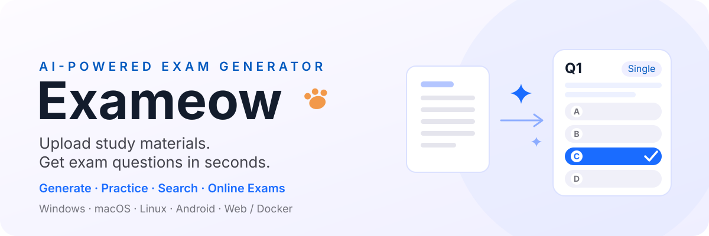

<p align="center">
  
</p>

<p align="center">
  <a href="https://github.com/heshengtao/exameow/releases"></a>
  <a href="LICENSE"></a>
  
  <a href="https://hub.docker.com/r/ailm32442/exameow"></a>
</p>

<p align="center">
  <a href="README_zh.md"><b>简体中文</b></a> ·
  <a href="README_zh_TW.md"><b>繁體中文</b></a> ·
  <a href="README.md"><b>English</b></a> ·
  <a href="README_ja.md"><b>日本語</b></a> ·
  <a href="README_ko.md"><b>한국어</b></a> ·
  <a href="README_es.md"><b>Español</b></a> ·
  <a href="README_fr.md"><b>Français</b></a> ·
  <a href="README_de.md"><b>Deutsch</b></a> ·
  <a href="README_ru.md"><b>Русский</b></a> ·
  <a href="README_ar.md"><b>العربية</b></a>
</p>

<p align="center">
  <a href="https://exam.superagentparty.com/"><b>ライブデモ</b></a> ·
  <a href="https://github.com/heshengtao/exameow/releases">アプリをダウンロード</a> ·
  <a href="https://hub.docker.com/r/ailm32442/exameow">Docker Hub</a>
</p>

## Exameowとは？

**Exameow（過了喵）** は、学習資料を数秒で高品質な試験問題に変換する**オープンソースのAI試験問題ジェネレーター**です。PDF、Word文書、PowerPointスライド、画像、テキストをアップロードするだけで、AIがコンテンツを解析し、単一選択問題、複数選択問題、○×問題、穴埋め問題、記述式問題を生成します。

アカウント登録、有料サブスクリプション、クラウドへのデータ送信が必要な他のAI出題ツールとは異なり、Exameowは**ローカルファーストかつプライバシー重視**です。問題集、演習記録、間違えた問題の履歴はすべてお使いのデバイス内に保存されます。デスクトップおよびモバイルアプリは、独自のOpenAI互換APIキー（OpenAI、DeepSeek、Qwen、GLM、または任意のセルフホストモデル）を使用して**完全オフラインで動作**します。

教師やトレーナー向けに、Exameowには**オンライン試験中継（リレー）システム**が内蔵されています。ローカルの問題集から試験を公開し、6桁の確認コードを共有するだけで、受講者は任意のブラウザから参加できます。即時自動採点、講師用成績ダッシュボード、不正利用防止機能が備わっています。1つのDockerコマンドでシステム全体をセルフホスト可能です。

<p align="center">
  <a href="https://exam.superagentparty.com/"></a>
</p>

## ライブデモ

オンラインで試す：**[exam.superagentparty.com](https://exam.superagentparty.com/)**

デモサイトはCloudflare Workersの無料AIプラン上で動作しています：

- ⏳ **1日の利用制限あり** — Cloudflareの無料AIクォータは毎日リセットされます
- 📄 **コンテキストウィンドウの制限** — 大きなドキュメントはモデルのコンテキストウィンドウに合わせて切り詰められます

無制限で使用するには、Dockerでセルフホストするか、独自のAPIキーを設定したデスクトップ/モバイルアプリをご利用ください。

## 特徴

### ✨ AI問題作成 — ファイルをアップロードして数秒で問題を生成

Exameowは**10種類以上のファイル形式**（PDF、DOCX、XLSX、PPTX、EPUB、ODT、TXT、CSV、HTML、画像：PNG/JPG/WEBP/GIF/BMP）の解析に対応しています。1つのファイルをアップロードするか、複数のファイルをまとめてドラッグ＆ドロップできます。AIは**5つの出題タイプ**（単一選択、複数選択、○×問題、穴埋め問題、記述式問題）に対応し、タイプごとの出題数、難易度（簡単/中等/難しい）、出力言語、トピック/章ごとの絞り込みを自由に調整できます。大きなドキュメントは自動的に分割され、重複を排除しながらバッチ生成されます。任意のOpenAI互換API（OpenAI、DeepSeek、Qwen、GLMなど）に対応しているほか、デモサイトに組み込まれた無料のCloudflare AIも使用可能です。結果はXLSXまたはCSVとしてエクスポートできます。

- **豊富な入力フォーマット** — PDF、DOCX、XLSX、PPTX、EPUB、ODT、TXT、CSV、HTML、画像（PNG/JPG/WEBP/GIF/BMP）、および各種テキスト/コードファイルに対応。ドラッグ＆ドロップによる複数ファイルアップロードをサポート
- **5つの出題タイプ** — 単一選択、複数選択、○×問題、穴埋め問題、記述式問題（タイプごとに出題数を設定可能）
- **詳細な設定コントロール** — 難易度（簡単/中等/難しい）、出力言語、トピック/章による絞り込み
- **スマートなバッチ処理** — 大容量ドキュメントを自動分割し、重複のない問題を順次作成
- **各種OpenAI互換APIに対応** — OpenAI、DeepSeek、Qwen、GLMなどに対応。デモサイトの無料Cloudflare AIも利用可能
- **エクスポート機能** — 作成した問題をXLSXまたはCSVとしてダウンロード

### 📚 演習モード — スマートに学習、効率的に記憶

生成された問題をインタラクティブな学習セッションに変換します。順番通りの演習、問題や選択肢のランダムシャッフル、自動作成された試験紙による時間制限付き模擬試験に対応しています。間違えた問題は自動的に記録・復習され、連続して正解すると間違えた問題リストから解除されます。テストモード（回答後に答えを確認）と暗記モード（問題と解答を同時に確認）を切り替え可能です。記述式問題はAIが模範解答と照らし合わせて自動採点し、コメントを提供します（手動での再採点もサポート）。スマートな列マッピングを備えたXLSX/CSVによる問題集のインポート/エクスポートにも対応しています。

- **順番演習** — 問題集の順番通りに1問ずつ練習
- **ランダム演習** — 問題と選択肢の順番をランダム化し、記憶の定着を促進
- **模擬試験** — 任意の問題集からタイプごとの出題数を設定してランダムな試験問題を自動作成
- **誤答復習** — 間違えた問題を自動追跡し、弱点のみを集中練習。連続正解でリストから自動除去
- **テスト / 暗記モード** — 自分で解いてから答え合わせ、または問題と解答を同時に確認
- **AI自動採点** — 記述式問題をAIが模範解答と比較して評価・コメント。手動での修正も可能
- **問題集管理** — スマートな列マッピングによるXLSX/CSVのインポート・エクスポート

### 📝 オンライン試験 — 試験を公開して受講者を招待

ローカルの複数の問題集から出題数や配点をタイプ別に設定して試験を作成できます。試験タイトル、開始時刻、制限時間を自由に設定可能です。**6桁の確認コード**または試験リンクを共有すれば、受講者はアプリのインストール不要で、任意のデバイスのブラウザから参加できます。ローカルのカウントダウンタイマーと自動提出機能により公平な試験を実施でき、ページを再読み込みしても進捗が保持されます。客観式問題は提出時にサーバー側で即座に採点され、解答と解説が表示されます。講師用ダッシュボードではスコア順のランキングや各問題の解答明細を確認できます。プライバシー保護のため、試験データは7日後に自動削除されます。不正利用対策として、1つのIPにつき1日20回までの公開制限、および3つの異なるIPからの通報による自動一時停止機能を備えています。**Dockerイメージは完全自己完結型**であり、オンライン試験リレーはSQLiteで動作するためデモサイトへの依存はありません。

- **問題集から試験を作成** — 複数のローカル問題集から出題数や配点を設定して試験を作成。タイトル、開始時刻、制限時間を設定可能
- **6桁コード＋アクセスリンク** — アプリ不要で、任意のブラウザからコード入力またはリンククリックで参加可能
- **時間制限付きセッション** — カウントダウンタイマーと自動提出機能。ページを更新しても途中から再開可能
- **即時採点** — 客観式問題は提出時にサーバー側で自動採点され、解説を表示。結果はローカルに保存していつでも確認可能
- **講師用成績ダッシュボード** — スコア順の表示と問題ごとの詳細分析。結果はローカルにキャッシュされるため再取得は1回のみ。講師はいつでも試験を削除可能（削除すると受講者のアクセスが即座に遮断され成績も消去）
- **プライバシー最優先** — 試験データはCloudflare D1上に最大7日間のみ保存され、自動削除。提出前は受講者に解答を送信しません
- **不正利用防止** — 1つのIPにつき1日20回までの発行制限。3つの異なるIPからの通報で自動一時停止。管理者は `#/admin` ページからレビュー、復元、削除が可能
- **完全セルフホスト対応** — Dockerイメージには同じ試験中継（SQLite）が同梱されており、デモサイトに依存しません。`ADMIN_TOKEN` で管理者ページを保護（デフォルトは `pass`、初回アクセス時に変更必須）

### 🔍 検索モード — 答えを素早く検索

問題のテキストを入力してローカルの問題集から検索でき、オプションでAIによる解説を取得できます。**写真検索**はデバイス上のOCRを使用してカメラ撮影やアップロード画像から問題を認識します（処理はブラウザ内でローカルに行われ、データは送信されません）。**ライブカメラ検索**はカメラを画面や紙に向けることで、AIが一致する問題をリアルタイムで検索します。**画面録画検索**は任意のウィンドウ上にキャプチャ枠を描画すると、AIがそれを監視して浮動オーバーレイに答えをリアルタイム表示します（Windows/macOS/Linux/Android対応。iOSはシステム制限のため非対応）。

- **テキスト検索** — 問題の文字を入力してローカル問題集から検索。AIによる解説生成も可能
- **写真検索** — 写真撮影または画像アップロードによる検索。ブラウザ内ローカルOCR動作（送信なし）
- **ライブカメラ検索** — カメラを画面や紙に向けるだけで、AIがリアルタイムで一致する問題を検索
- **画面録画検索** — 画面上に枠を描画し、AIがリアルタイムで問題を認識・検索してフローティングウィンドウに答えを表示（Windows / macOS / Linux / Android対応。iOSは非対応）

### 🌐 クロスプラットフォームとプライバシー — データを自分で管理

Exameowは**Windows、macOS、Linux、Android、Web**（iOSはセルフビルド）に対応しています。Web版は**1つのDockerコマンド**でデプロイ可能です。すべての問題集、演習記録、誤答履歴はローカルに保存され、オンライン試験機能を使用しない限りサーバーにアップロードされることはありません。デスクトップ版のAPIキーは**AES-256-GCM**で暗号化されて保存されます。UI言語はシステム言語（日本語/英語/中国語など）を自動検出し、ワンタップで切替可能です。

- **デスクトップ＆モバイル** — Windows, macOS, Linux, Android (iOSはセルフビルド)
- **セルフホストWeb版** — 1コマンドでDockerデプロイ
- **ローカルファースト** — データはすべて端末内に保持。デスクトップ版APIキーはAES-256-GCMで暗号化保存
- **多言語UI** — システム言語の自動検出とワンタップ切替

## インストール

すべてのプラットフォーム向けのビルド済みバイナリは [GitHub Releases](https://github.com/heshengtao/exameow/releases) ページからダウンロードできます。

### プラットフォームのサポート

| プラットフォーム | 状態 | ダウンロード形式 |
|------------------|------|------------------|
| Windows | ✅ 対応済み | `.msi` インストーラー / ポータブル `.zip` |
| macOS (Apple Silicon) | ✅ 対応済み | `.dmg`（Quarantine属性の解除方法はリリースノートを参照） |
| Linux (x86_64 / ARM64) | ✅ 対応済み | `.AppImage` / `.deb` |
| Android (ARM64) | ✅ 対応済み | `.apk` |
| iOS | ⚠️ セルフビルドが必要 | 下記の注記を参照 |
| Web / Docker (セルフホスト) | ✅ 対応済み | Dockerイメージ |

> **iOSについて:** Apple Developer Developer Programの費用（$99/年）が必要となるため、現時点ではビルド済みのiOSパッケージは提供していません。Xcodeを使用してご自身でビルドする必要があります（`pnpm tauri ios build`）。将来的に寄付によって証明書費用が賄えるようになれば、GitHub Releasesで公式署名済みのiOSビルドを公開する予定です。

### Docker（セルフホスト）

```bash
git clone https://github.com/heshengtao/exameow.git
cd exameow

# フロントエンドのビルド
cd frontend && pnpm install && pnpm build && cd ..

# AIプロバイダーの設定
export AI_ENDPOINT=https://api.openai.com/v1
export AI_API_KEY=sk-your-key-here
export AI_MODEL=gpt-4o

# ビルドと起動
docker compose up -d --build
```

ブラウザで `http://localhost:3000` を開きます。

> **🔐 管理者トークン（オンライン試験管理に必須）:** `http://localhost:3000/#/admin` の管理者ページは `ADMIN_TOKEN` で保護されています。設定しない場合、デフォルトは **`pass`** となり、**初回ログイン時に変更が強制**されます。これを回避するには、起動時に設定してください：
>
> ```bash
> ADMIN_TOKEN=your-strong-token docker compose up -d --build
> ```
>
> 変更されたトークンはコンテナが再起動しても `exameow-data` ボリューム（`/app/data/admin_token.txt`）内に保持されます。試験データ（SQLite）も同じボリュームに保存されます。

### Docker（ビルド済みイメージ）

```bash
docker pull ailm32442/exameow:latest
docker run -d -p 3000:3000 \
  -e AI_ENDPOINT=https://api.openai.com/v1 \
  -e AI_API_KEY=sk-your-key-here \
  -e AI_MODEL=gpt-4o \
  -e ADMIN_TOKEN=your-strong-token \
  -v exameow-data:/app/data \
  ailm32442/exameow:latest
```

`ADMIN_TOKEN` を設定しない場合、デフォルトは `pass` となり、`/#/admin` への初回アクセス時に変更が必要です。

## 環境変数

| 変数名 | デフォルト値 | 説明 |
|--------|--------------|------|
| `AI_ENDPOINT` | `https://api.openai.com/v1` | OpenAI互換のAPIエンドポイント |
| `AI_API_KEY` | — | AIプロバイダーのAPIキー |
| `AI_MODEL` | `gpt-4o` | 使用するデフォルトモデル |
| `PORT` | `3000` | サーバーのリスニングポート |
| `STATIC_DIR` | `/app/static` | 静的ファイルのディレクトリ |
| `ADMIN_TOKEN` | `pass` | 管理者ページのトークン。`pass` の場合は `/#/admin` での初回変更が必須 |
| `EXAM_DB_PATH` | `/app/data/exameow.db` | オンライン試験中継用SQLiteのパス |
| `ADMIN_TOKEN_FILE` | `/app/data/admin_token.txt` | 変更された管理者トークンの保存先 |
| `RUST_LOG` | `info` | ログレベル |

## APIエンドポイント

| メソッド | パス | 説明 |
|----------|------|------|
| `GET` | `/api/models` | 利用可能なAIモデルのリストを取得 |
| `POST` | `/api/generate` | ファイルをアップロードして試験問題を生成 |
| `GET` | `/api/export` | 問題をCSVとしてエクスポート |
| `POST` | `/api/export/xlsx` | 問題をXLSXとしてエクスポート |
| `POST` | `/api/config/save` | AI設定を保存 |
| `GET` | `/api/config/load` | 保存されたAI設定を読み込み |

### 問題生成のリクエスト例

```bash
curl -X POST http://localhost:3000/api/generate \
  -F "file=@study-material.pdf" \
  -F 'params={"question_types":["single_choice","multi_choice"],"count":10,"difficulty":"medium","language":"Chinese"}'
```

## アーキテクチャ

Exameowは単一のVue 3フロントエンドを共有する**3バックエンドアーキテクチャ**を採用しています。同一のSPAが実行時にプラットフォームを自動検出し、適切なバックエンドにルーティングします：

- **Tauri（デスクトップ/モバイル）**: `src-tauri/` 内のRustコマンドがRustコアライブラリを直接呼び出します
- **Cloudflare Workers**: `workers/` 内のTypeScriptがCloudflare AI + D1を呼び出してオンライン試験を中継します
- **Axum（セルフホスト/Docker）**: `packages/server/` 内のRust HTTPサーバーがSQLiteを使用して試験を中継します

コアロジック（ファイル解析、AIクライアント、問題生成、エクスポート）は共有の `packages/core/` Rustクレート内に実装されており、Workers経路向けにTypeScriptでも同等の機能が実装されています。

## よくある質問（FAQ）

### PDFから試験問題を生成するにはどうすればよいですか？

[デモサイト](https://exam.superagentparty.com/)またはデスクトップアプリでPDFをドラッグ＆ドロップしてアップロードします。出題タイプ（単一選択、複数選択、○×、穴埋め、記述式）を選択し、問題数と難易度を設定して「生成」をクリックします。AIがドキュメントを読み取り、数秒で問題を生成します。結果はXLSXまたはCSVで保存できます。

### Exameowは本当に完全無料ですか？

はい。ExameowはApache 2.0ライセンスのもとでオープンソースとして公開されており、100%無料です。有料プランや企業版、機能制限などは一切ありません。デモサイトでは無料のAI生成が提供されています（Cloudflare無料枠による1日あたりの制限あり）。デスクトップ/モバイルアプリでは独自のAI APIキーが必要となり、APIの利用料金は各プロバイダーに直接支払います。Exameowが料金を請求することはありません。

### オフラインで使用できますか？

はい。デスクトップおよびモバイルアプリは完全にオフラインで動作します。問題集、演習記録、誤答履歴はすべてローカルに保存されます。問題を生成するためにAI APIを呼び出す際のみインターネット接続が必要です。

### どのようなAIモデルに対応していますか？

OpenAI互換のあらゆるAPIに対応しています：OpenAI (GPT-4o, GPT-4, GPT-3.5)、DeepSeek、Qwen（通義千問）、GLM（智譜）、およびOllamaなどを介したセルフホストモデル。デモサイトでは内蔵された無料のCloudflare AIも利用可能です。

### オンライン試験機能はどのように機能しますか？

教員がローカルの問題集から6桁のコード付きで試験を公開します。受講者はそのコードまたは共有リンクを使用して任意のブラウザから参加します。試験には制限時間と自動提出機能があり、客観式問題は即座に採点されます。試験データは7日後に自動削除されます。セルフホストユーザーもDocker経由で同様の機能を利用できます。

### データのプライバシーは保護されていますか？

はい。デフォルトでは、すべてのデータ（問題集、演習記録、APIキー）がお使いの端末内にのみ保持されます。APIキーはAES-256-GCMで暗号化されます。唯一の例外はオンライン試験データであり、Cloudflare D1（7日間自動保持）または独自のSQLiteに一時的に保存されます。

## 開発

```bash
# Rust サーバー
cargo run -p exameow-server

# フロントエンド開発サーバー
cd frontend && pnpm dev

# Tauri デスクトップアプリ
pnpm tauri dev
```

### プロジェクト構造

```
exameow/
├── frontend/          # Vue 3 SPA
├── packages/
│   ├── core/          # Rust共有ライブラリ（AI, 解析, エクスポート, 設定）
│   ├── server/        # Axum HTTP サーバー
│   └── shared/        # TypeScript共有型定義
├── src-tauri/         # Tauri デスクトップ + モバイルアプリ
├── workers/           # Cloudflare Workers (Hono)
├── scripts/           # ビルドおよびデプロイスクリプト
├── Dockerfile
└── docker-compose.yml
```

## 免責事項

- 本プロジェクトは**オープンソースの学習用ツール**であり、個人学習、教育、内部トレーニングなどの正当な目的のみを対象としています。
- **AIが生成するコンテンツの正確性は保証されません。** 問題や解説に誤りが含まれる可能性があるため、使用前に人間による確認を行ってください。生成コンテンツの使用によって生じた一切の損害について、作者は責任を負いません。
- **ユーザー生成コンテンツ（UGC）に関する責任は投稿者に帰属します。** オンライン試験機能を使用して、違法、権利侵害、または機密性の高いデータを保存・配布することを禁止します。運営者は事前通知なしに違反コンテンツを削除する権利を有します。通報窓口：① 各試験ページの右上にある**通報ボタン**（3つ以上の異なるIPから通報された試験は**自動的にアクセス不可**となり管理者レビューに入ります）、② GitHub Issues。違反が確認された場合は速やかに削除され、誤って停止された試験は管理者が復元可能です。
- デモサイト（exam.superagentparty.com）は無料のパブリックサービスであり、**利用可能性やデータの永続性は保証されません**（試験データは最大7日間保持）。重要なデータは各自でバックアップを行ってください。
- 本プロジェクトを使用することにより、利用者はすべてのリスクに同意し、居住国の法令を遵守することに同意したものとみなされます。

## サポート

### Starをお願いします！
⭐ 皆様のご支援が開発の大きな励みとなります！

### 開発者を支援する
<div align="center" style="display: flex; gap: 20px; justify-content: center; flex-wrap: wrap;">

[](https://ko-fi.com/agentparty)
[](https://afdian.com/a/agentparty)

</div>

### 公式アカウントをフォロー
<div align="center">
  <a href="https://space.bilibili.com/26978344">
    
  </a>
  <a href="https://www.youtube.com/@agentParty">
    
  </a>
</div>

### コミュニティに参加
質問や問題がある場合は、お気軽にコミュニティにご参加ください。

1. QQグループ：`931057213`（第1グループ満員） / `902882342`（第2グループ）

2. Discord: [Discord リンク](https://discord.gg/f2dsAKKr2V)

## 貢献者

<a href="https://github.com/heshengtao/exameow/graphs/contributors">
  
</a>

## ライセンス

Apache-2.0

## サードパーティライセンス

本プロジェクトはサードパーティのオープンソースソフトウェアを使用しています。依存関係の完全なリスト、ライセンス、およびライセンスURLは [THIRD_PARTY_LICENSES.csv](THIRD_PARTY_LICENSES.csv) を参照してください。
