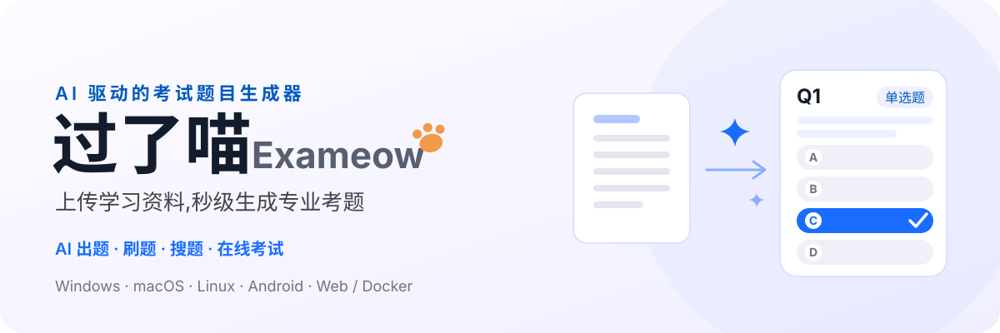
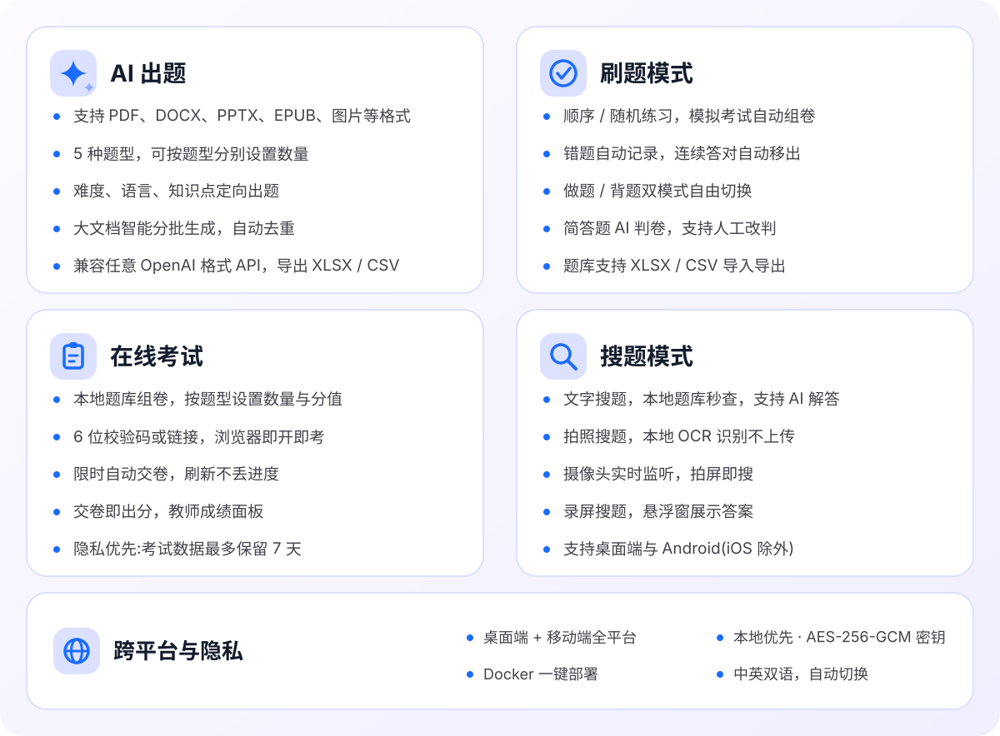
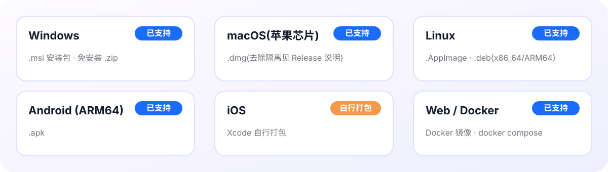
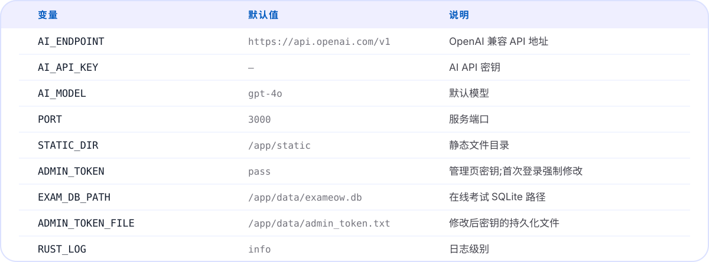
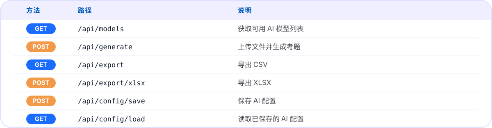
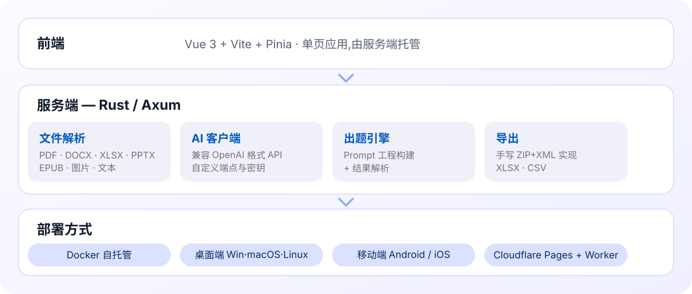

<p align="center">
  
</p>

<p align="center">
  <a href="https://github.com/heshengtao/exameow/releases"></a>
  <a href="LICENSE"></a>
  
  <a href="https://hub.docker.com/r/ailm32442/exameow"></a>
</p>

<p align="center">
  <a href="README.md">English</a> · <b>中文</b>
  <br>
  <a href="https://exam.superagentparty.com/"><b>在线演示</b></a> ·
  <a href="https://github.com/heshengtao/exameow/releases">下载安装</a> ·
  <a href="https://hub.docker.com/r/ailm32442/exameow">Docker 镜像</a>
</p>

<p align="center">
  <a href="https://exam.superagentparty.com/"></a>
</p>

## 在线演示

在线体验：**[exam.superagentparty.com](https://exam.superagentparty.com/)**

演示站基于 Cloudflare Workers 免费 AI 套餐运行：

- ⏳ **每日次数有限** — Cloudflare 免费 AI 额度每日重置
- 📄 **上下文窗口限制** — 过大的文档会被截断以适应模型上下文窗口

如需无限制使用，请通过 Docker 自托管，或使用桌面/移动应用并配置自己的 API Key。

## 功能

<p align="center">
  
</p>

<details>
<summary><b>完整功能清单</b></summary>

### ✨ AI 出题
- **丰富的输入格式** — 支持 PDF、DOCX、XLSX、PPTX、EPUB、ODT、TXT、CSV、HTML、图片（PNG/JPG/WEBP/GIF/BMP）及任意文本/代码文件，支持多文件拖拽上传
- **5 种题型** — 单选题、多选题、判断题、填空题、简答题，可按题型分别设置数量
- **精细化控制** — 难度（简单/中等/困难）、出题语言、知识点/章节定向出题
- **智能分批生成** — 大文档自动拆分分批生成，题目去重
- **兼容任意 OpenAI 格式 API** — OpenAI、DeepSeek、通义千问、智谱 GLM 等；也可直接使用演示站内置的 Cloudflare 免费 AI
- **导出** — 支持 XLSX / CSV 下载

### 📚 刷题模式
- **顺序练习** — 按题库顺序逐题练习
- **随机练习** — 题目和选项顺序随机打乱，避免位置记忆
- **模拟考试** — 从题库随机抽题自动组卷，可配置各题型数量
- **错题练习** — 自动记录错题，只练做错的题，连续答对自动移出
- **做题 / 背题模式** — 先答后对答案，或直接翻看题目和答案
- **AI 判卷** — 简答题由 AI 对照参考答案自动评判并给出评语，支持人工改判
- **题库管理** — 支持 XLSX/CSV 导入（智能列映射）与导出

### 📝 在线考试
- **从题库发起考试** — 本地题库多选组卷，可按题型分别设置抽题数量与分值，自定义考试名称、开始时间与时长
- **6 位校验码 + 考试链接** — 学生无需安装任何应用，任意设备浏览器打开链接或输入校验码即可参加
- **限时作答** — 本地倒计时、到时自动交卷；刷新页面不丢进度（断点续考）
- **交卷即出分** — 客观题服务端自动判分并展示答案解析，成绩本地留存随时查看
- **教师成绩面板** — 按分数排序、逐题作答明细展开；成绩本地缓存，考试结束后仅需查询一次，教师可随时一键删除考试（学生立即无法进入，成绩同步清除）
- **隐私优先** — 考试数据在 Cloudflare D1 最多保留 7 天自动删除；取题阶段不下发答案
- **反滥用机制** — 每 IP 每日限发 20 场；学生可一键举报，≥3 个独立 IP 举报自动暂停考试；管理员可在 `#/admin` 页面查看举报、恢复或强制删除
- **自托管独立运行** — Docker 版内置同款考试中转（SQLite)，完全不依赖演示站；用 `ADMIN_TOKEN` 环境变量设置管理密钥（默认 `pass`，首次访问 `#/admin` 强制修改）

### 🔍 搜题模式
- **文字搜题** — 输入题目文字，从本地题库中查找，支持 AI 解答
- **拍照搜题** — 拍摄或上传题目照片，本地 OCR 识别（浏览器端运行，无需上传）
- **拍屏搜题** — 摄像头对准屏幕或试卷，AI 实时监听并匹配题目
- **录屏搜题** — 框选屏幕任意区域，AI 实时识别并搜索本地题库，悬浮窗展示答案（支持 Windows / macOS / Linux / Android；iOS 因系统限制暂不支持）

### 🌐 跨平台与隐私
- **桌面与移动端** — Windows、macOS、Linux、Android（iOS 需自行打包）
- **自托管网页版** — Docker 一键部署
- **本地优先** — 题库、练习记录、错题本均保存在本机；桌面端 API 密钥使用 AES-256-GCM 加密存储
- **中英双语** — 自动跟随系统语言，一键切换

</details>

## 安装

各平台的预编译安装包可在 [GitHub Releases](https://github.com/heshengtao/exameow/releases) 页面下载。

### 平台支持

<p align="center">
  
</p>

<details>
<summary><b>文字版表格</b></summary>

| 平台 | 状态 | 下载格式 |
|------|------|----------|
| Windows | ✅ 已支持 | `.msi` 安装包 / 免安装 `.zip` |
| macOS（Apple 芯片） | ✅ 已支持 | `.dmg`（去除隔离属性见 Release 说明） |
| Linux（x86_64 / ARM64） | ✅ 已支持 | `.AppImage` / `.deb` |
| Android（ARM64） | ✅ 已支持 | `.apk` |
| iOS | ⚠️ 需自行打包 | 见下方说明 |
| Web / Docker（自托管） | ✅ 已支持 | Docker 镜像 |

</details>

> **关于 iOS：** 苹果开发者证书需要付费（$99/年），因此暂不提供预编译的 iOS 安装包，需要使用 Xcode 自行打包（`pnpm tauri ios build`）。未来如果打赏收入足够支付证书费用，会在 GitHub Releases 上提供带证书的官方打包版本。

### Docker 自托管

```bash
git clone https://github.com/heshengtao/exameow.git
cd exameow

# 构建前端
cd frontend && pnpm install && pnpm build && cd ..

# 配置 AI
export AI_ENDPOINT=https://api.openai.com/v1
export AI_API_KEY=sk-your-key-here
export AI_MODEL=gpt-4o

# 构建并启动
docker compose up -d --build
```

打开 `http://localhost:3000` 开始出题。

> **🔐 管理密钥（在线考试管理必看）:** 管理员页面 `http://localhost:3000/#/admin` 由 `ADMIN_TOKEN` 保护。**不设置时默认为 `pass`，首次登录会被强制要求修改后才能使用**。想跳过这步，启动时直接声明:
>
> ```bash
> ADMIN_TOKEN=你的强密钥 docker compose up -d --build
> ```
>
> 修改后的密钥会持久化在 `exameow-data` 数据卷(`/app/data/admin_token.txt`)中，容器重启不丢失；考试数据（SQLite）也存在同一数据卷。

### Docker 预构建镜像

```bash
docker pull ailm32442/exameow:latest
docker run -d -p 3000:3000 \
  -e AI_ENDPOINT=https://api.openai.com/v1 \
  -e AI_API_KEY=sk-your-key-here \
  -e AI_MODEL=gpt-4o \
  -e ADMIN_TOKEN=你的强密钥 \
  -v exameow-data:/app/data \
  ailm32442/exameow:latest
```

不设置 `ADMIN_TOKEN` 时默认为 `pass`，首次访问 `/#/admin` 会被强制修改。

## 环境变量

<p align="center">
  
</p>

<details>
<summary><b>文字版表格</b></summary>

| 变量 | 默认值 | 说明 |
|------|--------|------|
| `AI_ENDPOINT` | `https://api.openai.com/v1` | OpenAI 兼容 API 地址 |
| `AI_API_KEY` | — | AI API 密钥 |
| `AI_MODEL` | `gpt-4o` | 默认模型 |
| `PORT` | `3000` | 服务端口 |
| `STATIC_DIR` | `/app/static` | 静态文件目录 |
| `ADMIN_TOKEN` | `pass` | 管理员页密钥;`pass` 时首次访问 `/#/admin` 强制修改 |
| `EXAM_DB_PATH` | `/app/data/exameow.db` | 在线考试 SQLite 路径 |
| `ADMIN_TOKEN_FILE` | `/app/data/admin_token.txt` | 修改后的密钥持久化文件 |
| `RUST_LOG` | `info` | 日志级别 |

</details>

## API 接口

<p align="center">
  
</p>

<details>
<summary><b>文字版表格</b></summary>

| 方法 | 路径 | 说明 |
|------|------|------|
| `GET` | `/api/models` | 获取可用 AI 模型列表 |
| `POST` | `/api/generate` | 上传文件并生成考题 |
| `GET` | `/api/export` | 导出 CSV |
| `POST` | `/api/export/xlsx` | 导出 XLSX |
| `POST` | `/api/config/save` | 保存 AI 配置 |
| `GET` | `/api/config/load` | 读取已保存的 AI 配置 |

</details>

### 生成考题示例

```bash
curl -X POST http://localhost:3000/api/generate \
  -F "file=@学习资料.pdf" \
  -F 'params={"question_types":["single_choice","multi_choice"],"count":10,"difficulty":"medium","language":"Chinese"}'
```

## 架构

<p align="center">
  
</p>

## 开发

```bash
# Rust 服务端
cargo run -p exameow-server

# 前端开发服务器
cd frontend && pnpm dev

# Tauri 桌面端
pnpm tauri dev
```

### 项目结构

```
exameow/
├── frontend/          # Vue 3 前端
├── packages/
│   ├── core/          # Rust 核心库（AI、解析、导出、配置）
│   ├── server/        # Axum HTTP 服务端
│   └── shared/        # TypeScript 共享类型
├── src-tauri/         # Tauri 桌面 + 移动端应用
├── workers/           # Cloudflare Workers (Hono)
├── scripts/           # 构建和部署脚本
├── Dockerfile
└── docker-compose.yml
```

## 免责声明

- 本项目为**开源学习工具**,仅供个人学习、教学与内部培训等合法场景使用。
- **AI 生成内容的准确性不作保证**。题目与解析可能存在错误,请人工核对后使用;因使用生成内容造成的任何后果,项目作者不承担责任。
- **用户生成内容(UGC)与本项目无关**。通过在线考试功能发布的内容由发布者(教师)自行负责,严禁用于存储或分发违法违规、侵权或敏感信息;运营方有权在不通知的情况下删除违规内容。举报渠道:① 考试页面右上角内置**举报按钮**——当 ≥3 个不同 IP 的用户举报同一场考试时,该考试链接会**自动锁定为不可访问**,进入管理员复核队列;② 通过 GitHub Issues 举报。核实后违规内容将予以下架,误封的考试可由管理员恢复。
- 演示站(exam.superagentparty.com)为免费公共服务,**不承诺可用性与数据持久性**(考试数据最多保留 7 天)。重要数据请自行备份。
- 使用本项目即表示你同意自行承担使用风险,并遵守所在国家/地区的法律法规。

## 支持我们

### 请给我们点个 Star！
⭐ 你的支持是我们前进的动力！

### 欢迎打赏！
<div align="center" style="display: flex; gap: 20px; justify-content: center; flex-wrap: wrap;">

[](https://ko-fi.com/agentparty)
[](https://afdian.com/a/agentparty)

</div>

### 关注我们
<div align="center">
  <a href="https://space.bilibili.com/26978344">
    
  </a>
  <a href="https://www.youtube.com/@agentParty">
    
  </a>
</div>

### 加入社区
如果你在使用过程中遇到任何问题，欢迎加入我们的社区交流。

1. QQ 群：`931057213`（1群已满） `902882342`（2群）

2. Discord: [Discord 链接](https://discord.gg/f2dsAKKr2V)

## 贡献者

<a href="https://github.com/heshengtao/exameow/graphs/contributors">
  
</a>

## License

Apache-2.0
