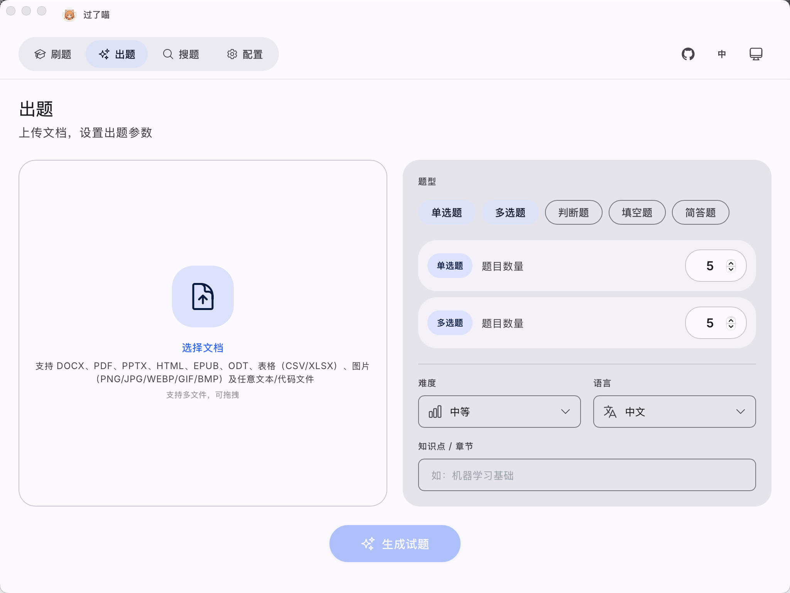

# 过了喵 Exameow

AI 驱动的考试题目生成器。上传学习资料，秒级生成专业考题。

<div align="center">

[](README.md)
[](README_zh.md)

</div>



## 功能

- **文档解析** — 支持 PDF、DOCX、XLSX、PPTX、EPUB、ODT、TXT、CSV、HTML
- **AI 出题** — 兼容所有 OpenAI 格式 API（OpenAI、DeepSeek、通义千问、智谱 GLM 等）
- **多种题型** — 单选题、多选题、判断题、填空题、简答题
- **导出** — 支持 XLSX / CSV 下载
- **练习模式** — 内置刷题系统，支持错题记录
- **多平台** — 桌面端（macOS/Windows/Linux）、移动端（iOS/Android）、Web、Docker、Cloudflare

## 安装

各平台的预编译安装包可在 [GitHub Releases](https://github.com/heshengtao/exameow/releases) 页面下载。

### 平台支持

| 平台 | 状态 | 下载格式 |
|------|------|----------|
| Windows | ✅ 已支持 | `.msi` 安装包 / 免安装 `.zip` |
| macOS（Apple 芯片） | ✅ 已支持 | `.dmg`（去除隔离属性见 Release 说明） |
| Linux（x86_64 / ARM64） | ✅ 已支持 | `.AppImage` / `.deb` |
| Android（ARM64） | ✅ 已支持 | `.apk` |
| iOS | ⚠️ 需自行打包 | 见下方说明 |
| Web / Docker（自托管） | ✅ 已支持 | Docker 镜像 |

> **关于 iOS：** 苹果开发者证书需要付费（$99/年），因此暂不提供预编译的 iOS 安装包，需要使用 Xcode 自行打包（`pnpm tauri ios build`）。未来如果打赏收入足够支付证书费用，会在 GitHub Releases 上提供带证书的官方打包版本。

### Docker 自托管

```bash
git clone https://github.com/heshengtao/exameow.git
cd exameow

# 构建前端
cd frontend && pnpm install && pnpm build && cd ..

# 配置 AI
export AI_ENDPOINT=https://api.openai.com/v1
export AI_API_KEY=sk-your-key-here
export AI_MODEL=gpt-4o

# 构建并启动
docker compose up -d --build
```

打开 `http://localhost:3000` 开始出题。

### Docker 预构建镜像

```bash
docker pull ailm32442/exameow:latest
docker run -d -p 3000:3000 \
  -e AI_ENDPOINT=https://api.openai.com/v1 \
  -e AI_API_KEY=sk-your-key-here \
  -e AI_MODEL=gpt-4o \
  ailm32442/exameow:latest
```

## 环境变量

| 变量 | 默认值 | 说明 |
|------|--------|------|
| `AI_ENDPOINT` | `https://api.openai.com/v1` | OpenAI 兼容 API 地址 |
| `AI_API_KEY` | — | AI API 密钥 |
| `AI_MODEL` | `gpt-4o` | 默认模型 |
| `PORT` | `3000` | 服务端口 |
| `STATIC_DIR` | `/app/static` | 静态文件目录 |
| `RUST_LOG` | `info` | 日志级别 |

## API 接口

| 方法 | 路径 | 说明 |
|------|------|------|
| `GET` | `/api/models` | 获取可用 AI 模型列表 |
| `POST` | `/api/generate` | 上传文件并生成考题 |
| `GET` | `/api/export` | 导出 CSV |
| `POST` | `/api/export/xlsx` | 导出 XLSX |
| `POST` | `/api/config/save` | 保存 AI 配置 |
| `GET` | `/api/config/load` | 读取已保存的 AI 配置 |

### 生成考题示例

```bash
curl -X POST http://localhost:3000/api/generate \
  -F "file=@学习资料.pdf" \
  -F 'params={"question_types":["single_choice","multi_choice"],"count":10,"difficulty":"medium","language":"Chinese"}'
```

## 架构

```
┌─────────────────────────────────────────────────────┐
│  前端 (Vue 3 + Vite + Pinia)                        │
│  由 Rust 服务端作为静态文件托管                      │
├─────────────────────────────────────────────────────┤
│  服务端 (Rust / Axum)                               │
│  ├── 文件解析   (PDF, DOCX, XLSX, PPTX, EPUB…)     │
│  ├── AI 客户端  (OpenAI 兼容 API)                   │
│  ├── 出题引擎   (Prompt 工程 + 解析)                │
│  └── 导出       (XLSX, CSV)                        │
├─────────────────────────────────────────────────────┤
│  部署方式                                           │
│  ├── Docker（自托管）                                │
│  ├── Tauri 桌面端（macOS / Windows / Linux）         │
│  ├── Tauri 移动端（iOS / Android）                   │
│  └── Cloudflare Pages + Worker                      │
└─────────────────────────────────────────────────────┘
```

## 开发

```bash
# Rust 服务端
cargo run -p exameow-server

# 前端开发服务器
cd frontend && pnpm dev

# Tauri 桌面端
pnpm tauri dev
```

### 项目结构

```
exameow/
├── frontend/          # Vue 3 前端
├── packages/
│   ├── core/          # Rust 核心库（AI、解析、导出、配置）
│   ├── server/        # Axum HTTP 服务端
│   └── shared/        # TypeScript 共享类型
├── src-tauri/         # Tauri 桌面 + 移动端应用
├── workers/           # Cloudflare Workers (Hono)
├── scripts/           # 构建和部署脚本
├── Dockerfile
└── docker-compose.yml
```

## 支持我们

### 请给我们点个 Star！
⭐ 你的支持是我们前进的动力！

### 欢迎打赏！
<div align="center" style="display: flex; gap: 20px; justify-content: center; flex-wrap: wrap;">

[](https://ko-fi.com/agentparty)
[](https://afdian.com/a/agentparty)

</div>

### 关注我们
<div align="center">
  <a href="https://space.bilibili.com/26978344">
    
  </a>
  <a href="https://www.youtube.com/@agentParty">
    
  </a>
</div>

### 加入社区
如果你在使用过程中遇到任何问题，欢迎加入我们的社区交流。

1. QQ 群：`931057213`（1群已满） `902882342`（2群）

<div align="center">
    
</div>

2. Discord: [Discord 链接](https://discord.gg/f2dsAKKr2V)

## 贡献者

<a href="https://github.com/heshengtao/exameow/graphs/contributors">
  
</a>

## License

Apache-2.0
